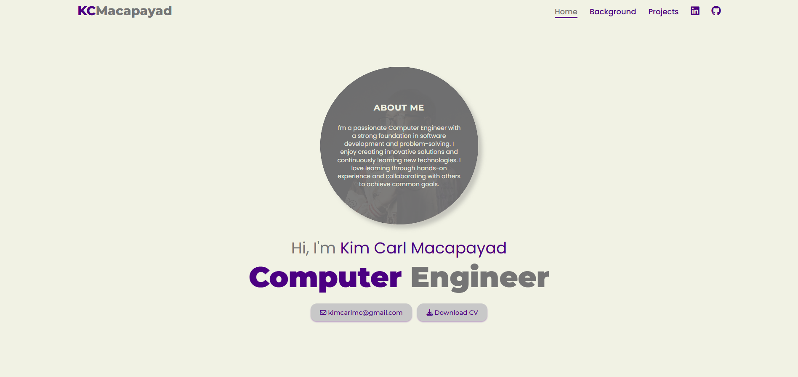
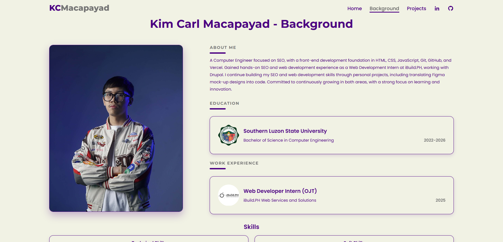
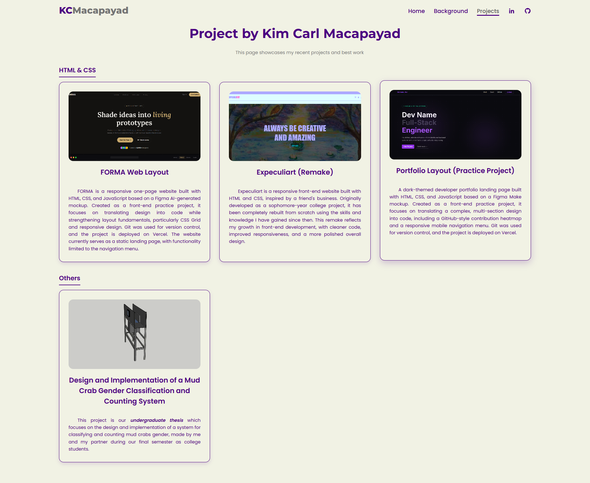

# Personal Portfolio

Welcome to my personal portfolio website! This project showcases my SEO expertise, front-end development skills, educational background, and professional experience as a Computer Engineering graduate specializing in SEO.

**Live Website:** https://kcmacapayad-portfolio.vercel.app

---

## About

This portfolio serves as my online professional profile, providing visitors with an overview of my qualifications, experience, and skills in SEO and front-end web development. It was built and optimized from the ground up as a real-world SEO case study — not just a showcase, but a working example of on-page and technical SEO applied to my own site.

---

## SEO Implementation

This site isn't just described as SEO-focused — it's built to demonstrate it. Implementation includes:

- `sitemap.xml` submitted to Google Search Console
- Canonical tags on all pages
- Open Graph and Twitter Card metadata for rich social sharing
- Descriptive, unique page titles and meta descriptions per page
- GA4 analytics integration
- Image and performance optimization
- Semantic HTML structure for crawlability and accessibility

---

## Features

- Responsive and modern user interface
- Professional introduction and personal profile
- Educational background section
- Work experience overview
- Technical and soft skills showcase
- Featured projects section
- Quick access to GitHub and LinkedIn profiles
- Mobile-friendly design

---

## Navigation

### Home

The landing page containing a brief introduction and overview of my professional profile as an SEO specialist with a front-end development background.

### Background

A dedicated section that includes:

#### Education
Details about my academic journey and achievements in Computer Engineering.

#### Work Experience
Information about my internship at iBuild.PH Web Services and Solutions, where I gained hands-on SEO and Drupal CMS experience.

#### Skills

**Technical Skills**
- SEO (technical & on-page)
- HTML, CSS, JavaScript
- Git & GitHub
- Drupal
- Responsive Web Design

**Soft Skills**
- Communication
- Teamwork
- Problem-solving
- Adaptability
- Time Management

### Projects

Featured academic, personal, and professional projects, including a thesis project, a Figma-to-code web layout build, and a front-end site remake.

### Social Links
- [GitHub Profile](https://github.com/kimcarlmc)
- [LinkedIn Profile](https://www.linkedin.com/in/kim-carl-u-macapayad-432185373/)

---

## Technologies Used

- HTML5
- CSS3
- JavaScript
- Git & GitHub
- Vercel
- Google Search Console & GA4

---

## Project Status

The portfolio is continuously being updated with new projects, experience, and improvements as I continue building my SEO specialization.

---

## Author

**Kim Carl Macapayad**
SEO Specialist | Computer Engineer

Portfolio: https://kcmacapayad-portfolio.vercel.app

---

Thank you for visiting my portfolio!
